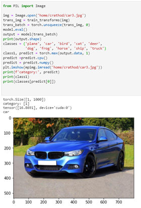

# Deep-Learning-with-HPC

## Goal
Training a Pytorch Deep learning model on a Jupyter Notebook with a High Performance Computer and GPU.

## Steps to follow

### Create a Conda virtual environment in the terminal

Follow the steps in bullet points
* module add anaconda3/5.1.0

A conda virtual environment allows you to run/install a version of Python and package as needed within it.
This environment, once created/modified is saved and can be accessed later through the code:

* conda create -n NAME_OF_ENV python=3.5                       # (Create Environment)
* source activate NAME_OF_ENV                                  # (Activate Environment)
* source deactivate NAME_OF_ENV                                # (Deactivate Environment)

### Install necessary packages in the terminal
Add cuda and cudnn module:

* module add cuda-toolkit/10.0.130
*module add cuDNN/10.0v7.4.2

Install Pytorch and Torchvision libraries using conda fro here  # https://pytorch.org/get-started/locally/

### Training deep learning model for Image Classification

Download the base code from the Base_code fo;lder -  base.ipynb, common.py and models.py. The base.ipynb allows you to use your web browser as the GUI to run/edit/debug.

There are multiple steps in the sample code files:

*	Load the training and test datasets from torchvision        # https://pytorch.org/docs/stable/torchvision/datasets.html
Training Data can be obtained from various online sources, self-procured or can even be imported from a library like Pytorch.
*	Define a Convolutional Neural Network                       # https://medium.com/@RaghavPrabhu/understanding-of-convolutional-neural-network-cnn-deep-learning-99760835f148
*	Define a loss function                                      # https://algorithmia.com/blog/introduction-to-loss-functions      
*	Train the network on the training data with different number of Epochs (reference).  # https://towardsdatascience.com/epoch-vs-iterations-vs-batch-size-4dfb9c7ce9c9

## Tasks 

### 1) Run the existing sample code “base.ipynb”. During the training check what is your GPU usage percentage using the command “nvidia-smi –l”.

Change the Number of Epochs, Learning Rate, Batch Size and check your test accuracy everytime.

##Test Accuracy

##GPU percentage

### 2) Modify the code for better performance by using two GPUs and check your GPU performance again and test accuracy. Also try changing the CNN model to different models. Refer - https://pytorch.org/docs/stable/torchvision/models.html 

##Test Accuracy

##GPU percentage using 1 GPU

##GPU percentage using 2 GPU

### 3) Plotting the accuracy against the number of training Epochs on a Graph using matplotlib. Plotting the graph for Epochs in range vs Training Accuracy. 

## Graph

### 4) Improving the network model for better training accuracy using different CNN model, batch size, Learning rate, and Epochs. Plotting the graph everytime for analyzing.

##Test Accuracy

##GPU percentage using 1 GPU

## Graph

### 5) Performing a model inference for a certain images. You can change other images. The image shall include the object which belongs to the category of the training dataset.

### Model Inference with Result

## Dependencies

* Python > 3
* Multiple GPU 
* CIFAR 10 Dataset - https://www.cs.toronto.edu/~kriz/cifar.html (Python Version)
* Jupyter Notebook
* Matplotlib python
* CUDA 11
* pytorch
* torchvision

## Challenges

1) Jupyter Notebook Environment Issue

(Attention: if you install those modules under a certain environment variable)
You may encounter this error when running the base.ipynb in Jupyter Hub:
"no module named torch"
It means your Jupyter notebook is running in the default python environment, but your torch module is installed in your Conda virtual environment. You will need to run Jupyter notebook in your virtual env.
Here is a tutorial: https://janakiev.com/blog/jupyter-virtual-envs/

2) HTTP 800 connection Failed

###Solution - use this command -  export LD_PRELOAD=""

# License
Copyright (C) 2020 Chinmay Rathod.

This program is free software: you can redistribute it and/or modify it under the terms of the GNU General Public License as published by the Free Software Foundation, either version 3 of the License, or (at your option) any later version.

This program is distributed in the hope that it will be useful, but WITHOUT ANY WARRANTY; without even the implied warranty of MERCHANTABILITY or FITNESS FOR A PARTICULAR PURPOSE. See the GNU General Public License for more details.

You should have received a copy of the GNU General Public License along with this program. If not, see http://www.gnu.org/licenses/
